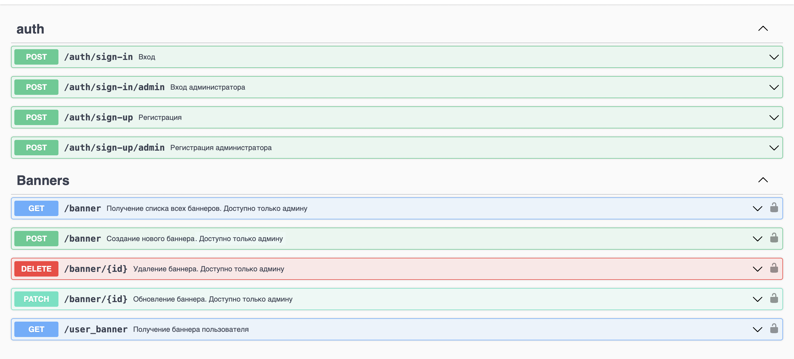

# Сервис баннеров
В Авито есть большое количество неоднородного контента, для которого необходимо иметь единую систему управления.  В частности, необходимо показывать разный контент пользователям в зависимости от их принадлежности к какой-либо группе. Данный контент мы будем предоставлять с помощью баннеров.
## Описание задачи
Необходимо реализовать сервис, который позволяет показывать пользователям баннеры, в зависимости от требуемой фичи и тега пользователя, а также управлять баннерами и связанными с ними тегами и фичами.
## Общие вводные
**Баннер** — это документ, описывающий какой-либо элемент пользовательского интерфейса. Технически баннер представляет собой  JSON-документ неопределенной структуры. 
**Тег** — это сущность для обозначения группы пользователей; представляет собой число (ID тега). 
**Фича** — это домен или функциональность; представляет собой число (ID фичи).  
1. Один баннер может быть связан только с одной фичей и несколькими тегами
2. При этом один тег, как и одна фича, могут принадлежать разным баннерам одновременно
3. Фича и тег однозначно определяют баннер

Так как баннеры являются для пользователя вспомогательным функционалом, допускается, если пользователь в течение короткого срока будет получать устаревшую информацию.  При этом существует часть пользователей (порядка 10%), которым обязательно получать самую актуальную информацию. Для таких пользователей нужно предусмотреть механизм получения информации напрямую из БД.
то обычные пользователи не должны его получать, при этом админы должны иметь к нему доступ.

## Cтек
- **Язык сервиса:** Go.
- **База данных:**  PostgreSQL.
- **Система кеширования:**  Redis.
- Для **деплоя зависимостей и самого сервиса** используется Docker и Docker Compose.


## Инструкции по сборке
- Для сборки сборки проекта:
```bash
make build
```
- Для запуска:
```bash
make run
```
- Для миграций базы данных в проект:
```bash
make migrate
```
- Для удвления базы данных:
```bash
make migrate_down
```
- Для запуска тестов (Необходима самая 1 версия базы после миграции)
Если вы что-то добавили в базу, необходимо сделать make migrate_down и make migrate и затем:
```bash
make tests
```
- Для остановки и удаления контейнера:
```bash
make stop
```


## Ход решения

Так как четкого запроса к структуре базы данных не было, исходя из инофрмации "Один баннер может быть связан только с одной фичей и несколькими тегами"
я решил сделать зависимость банеров один ко многим.
Таким образом в моей бд есть таблица banners_tags в которой хранятся связи между банерами и тегами.
Также я предположил, что теги уже предоставлены аналитиками и внес их в отдельную таблицу tags.
В проекте предусметрена регистрация пользователей и админов, данные о них хранятся в таблице Users.

Таким образом моя база данных имеет следующий вид:


Весь код написан вручную без использования Swagger, ReDoc и т.п.
Swagger использовал для генерации документации к коду и веб интерфейса тестирования SwaggerUI.

## Доступные URL


## Примеры
Для наглядного тестирования использовался postman.

1. Регистрация и аутентификация. 
- При регистрации получаем id пользователя.
   

- При аутентификации jwt token.
- 

2. Создание банеров. Доступно только с токеном админа с Bearer авторизацией.
- В ответ получаем id баннера.


3. Получение баннера пользователя.
- В ответ получаем контент банера.
  

- Если повторно показывать эти баннеры пользователям, то они достаются из кеша и время ответа уменьшается в 5-10 раз:
  

Другие эндпоинты можно посмотреть самостоятельно, использовав этот [API](https://github.com/avito-tech/backend-trainee-assignment-2024/blob/main/api.yaml)
и эту структуру баннера:
<pre>
{
  "tag_ids": [ ],
  "feature_id": ,
  "content": {
    "text": "text_template",
    "title": "title_template",
    "url": "https//template"
  },
  "is_active": true
}
</pre>

## Условия
1. Тегов и фичей небольшое количество (до 1000), RPS — 1k, SLI времени ответа — 50 мс, SLI успешности ответа — 99.99%
2. Для авторизации доступов должны использоваться 2 вида токенов: пользовательский и админский.  Получение баннера может происходить с помощью пользовательского или админского токена, а все остальные действия могут выполняться только с помощью админского токена.  
4. Если при получении баннера передан флаг use_last_revision, необходимо отдавать самую актуальную информацию.  В ином случае допускается передача информации, которая была актуальна 5 минут назад.
5. Баннеры могут быть временно выключены. Если баннер выключен, то обычные пользователи не должны его получать, при этом админы должны иметь к нему доступ.

